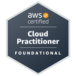

# Hello, I'm DevOps Engineer :wave:
## Connect with Me
 
 
I am Ekrem SARIYER, a Cloud and DevOps Engineer, as well as a Frontend Developer. I specialize in building distributed, scalable systems using Go, Node.js, and JavaScript. My interests lie in microservices and software development.

## 🧑‍💻 Professional Skills
- **Language**: JavaScript, Python
- **Framework**: React, CSS, Bootstrap, Material-UI
- **DevOps**: AWS, Docker, Kubernetes, Ansible, Jenkins, Terraform, Maven, Nexus
- **Logging and Monitoring**: Prometheus, Grafana
- **Database**: SQL, PostgreSQL / NoSQL (MongoDB, DynamoDB)

               

 
## :star:️ More Open Source Projects
- [**ansible-project-playbook-role**](https://github.com/ekrem0691/ansible-project-playbook-role): This project aims to deploy a web application consisting of PostgreSQL, Node.js, and React components within Docker containers on AWS EC2 instances using Ansible.
 
- [**Kubernetes-Microservice-Phonebook**](https://github.com/ekrem0691/Kubernetes-Microservice-Phonebook): This project involves deploying a Phonebook web application using a microservice architecture with Python Flask and MySQL on Kubernetes. The app will have separate services for frontend and backend operations, managed via Kubernetes deployments, and will use Docker containers for each component..

## CERTIFICATIONS

